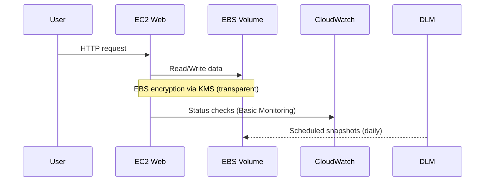

`docs(diagrams): refine data flow and notes`

# Data Flow

```mermaid
sequenceDiagram
  participant U as User
  participant EC2 as EC2 Web
  participant EBS as EBS Volume
  participant CW as CloudWatch
  participant DLM as DLM

  U->>EC2: HTTP request
  EC2->>EBS: Read/Write data
  Note over EC2,EBS: EBS encryption via KMS (transparent)
  EC2->>CW: Status checks (Basic Monitoring)
  DLM-->>EBS: Scheduled snapshots (daily)
```
## Notes

- No secrets in User Data; IMDSv2 required.

- Snapshot retention is intentionally short in development to minimize cost.
