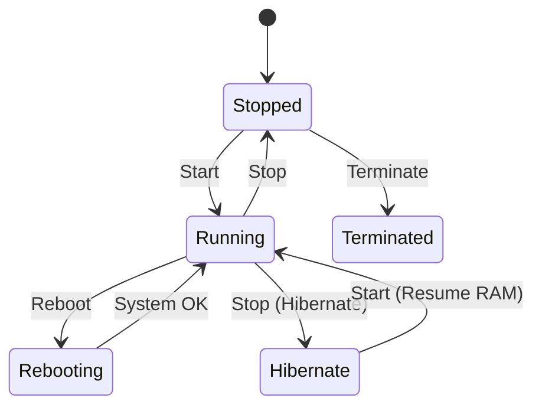

`docs(diagrams): add EC2 lifecycle including hibernate`

# EC2 Instance Lifecycle (with Hibernate)

## Notes

- Billing applies when Running/Rebooting and when Stopping for Hibernate operations occur.

- Hibernate preserves RAM contents on the root volume; suitable for fast warm-up.
